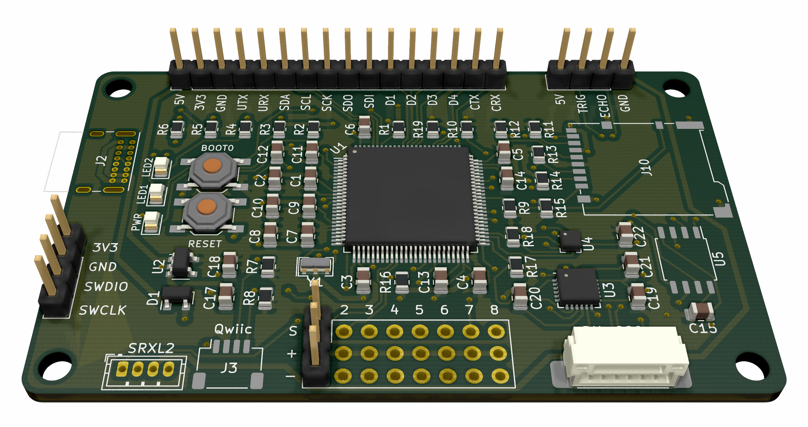

# Oxygen F7 Flight Controller

## Hardware

- Designed for fixed-wing aircraft
- STM32F756
- MPU-6000 gyroscope & accelerometer
- BMP-388 barometer
- 8 PWM servo outputs
- SRXL2 receiver input
- Qwiic I2C port
- Connector for HC SR-04 ultrasonic distance sensor
- Connector for BN-880Q GPS and compass
- Header with various pins for debugging and experimentation
- USB-C
- microSD slot
- 128MB external flash memory

## Firmware

- Built with Rust
- Very early work-in-progress!!